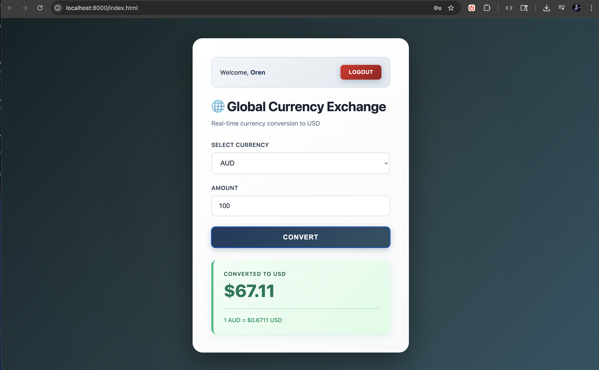

# Global Currency Exchange

A professional currency converter application built with Laravel 11 and Sanctum authentication.



## Features

- **Token Authentication** - Secure API authentication using Laravel Sanctum
- **Real-time Conversion** - Convert any currency to USD with live exchange rates
- **Smart Caching** - 24-hour rate caching to minimize API calls
- **Professional Design** - Modern financial UI with navy blue and gold accents
- **Responsive Layout** - Works seamlessly on all devices
- **Clean Code** - Simple, readable, and well-structured codebase

## Tech Stack

- Laravel 11
- Laravel Sanctum (API Authentication)
- SQLite Database
- Vanilla JavaScript (no framework dependencies)
- Exchange Rate API

## Installation

### Requirements

- PHP 8.2+
- Composer
- SQLite

### Setup

1. Clone the repository:
```bash
git clone https://github.com/oepsteindev/currencyConverter.git
cd currencyConverter
```

2. Install dependencies:
```bash
composer install
```

3. Copy environment file:
```bash
cp .env.example .env
```

4. Generate application key:
```bash
php artisan key:generate
```

5. Run migrations:
```bash
php artisan migrate
```

6. Start the development server:
```bash
php artisan serve
```

7. Open your browser and visit:
```
http://localhost:8000/index.html
```

## Usage

1. **Register** a new account or **Login** with existing credentials
2. **Select a currency** from the dropdown menu
3. **Enter an amount** to convert
4. Click **Convert** to see the USD equivalent
5. View the conversion rate and last update time

## API Endpoints

### Public Routes
- `POST /api/register` - Create a new user account
- `POST /api/login` - Authenticate and receive access token

### Protected Routes (require Bearer token)
- `GET /api/currencies` - Get all currency exchange rates
- `POST /api/convert` - Convert currency to USD
- `GET /api/user` - Get current user information
- `POST /api/logout` - Revoke access token

## Configuration

The application uses SQLite by default. To use a different database, update your `.env` file:

```env
DB_CONNECTION=mysql
DB_HOST=127.0.0.1
DB_PORT=3306
DB_DATABASE=currency_api
DB_USERNAME=root
DB_PASSWORD=your_password
```

Cache is set to file-based. For production, consider using Redis:

```env
CACHE_STORE=redis
```

## Project Structure

```
app/
├── Http/Controllers/
│   ├── AuthController.php      # User authentication
│   └── CurrencyController.php  # Currency conversion logic
└── Models/
    └── User.php                # User model with Sanctum

routes/
└── api.php                     # API route definitions

public/
└── index.html                  # Frontend application

database/
└── migrations/                 # Database schema
```

## License

Open source - use however you want.
